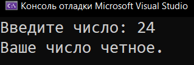
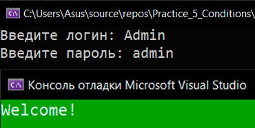

# Practice_5_Conditions
Практика: Conditions

<a href="https://gist.github.com/SlavikArt/dbe9e80e30c5808e99a2bf22a34881d7">Gist - страница со всеми кодами проектов</a>

* [Even_Or_Odd](Even_Or_Odd)
* [Log_In](Log_In)

    <h2>Even or odd</h2>
    
Четное или нечетное?

    
    <h2>Log in</h2>
    
Авторизация пользователя

    

